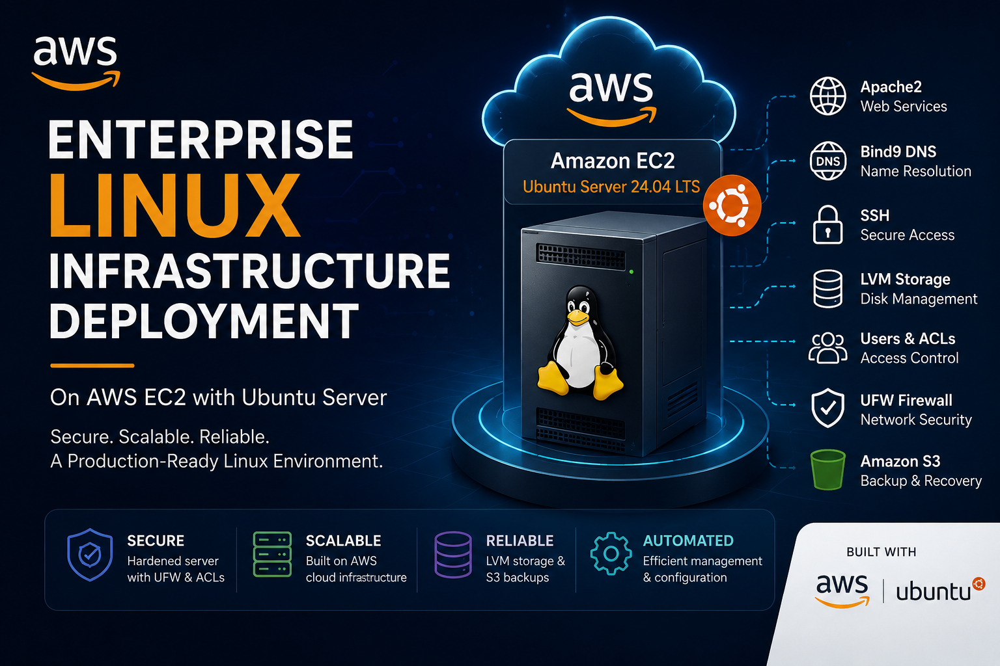

# Olabisi James Arowosoye | Professional IT Portfolio

Welcome to my professional portfolio. I earned a **Bachelor of Applied Science in Information Technology** from **Ensign College**, where I developed practical experience in cloud computing, cybersecurity, systems administration, business intelligence, technical support, networking, and web development.

My portfolio showcases real-world projects, professional experience, and technical skills developed through academic studies, industry experience, and continuous learning. Each project reflects my passion for using technology to solve business problems, improve operational efficiency, and deliver meaningful business value.

---

## 👨‍💻 Professional Profile

- 🎓 Bachelor of Applied Science in Information Technology – Ensign College
- 💼 Business Intelligence Analyst at MALCO Transport Limited
- 🖥️ Technical Support Engineer at HSProjects Technologies
- 🌍 Project Manager & Web Developer – Ouelessebougou Alliance
- 🏢 Co-Founder – TIM BROWN SERVICES

---

## 🚀 Areas of Expertise

My technical experience spans cloud computing, systems administration, business intelligence, cybersecurity, databases, networking, programming, and web technologies.

  

---

## ⭐ Featured Projects

### 📊 Fleet Operations Dashboard for MALCO Transport Limited

  

Developed an interactive Business Intelligence solution that transforms fleet operational data into actionable insights for logistics management.

🔗 **[View Complete Case Study →](projects/business-intelligence/malco-dashboard/README.md)**

---

### 🐧 Enterprise Linux Infrastructure Deployment

  

Designed and deployed a secure enterprise Linux infrastructure implementing web services, DNS, storage management, and layered security on AWS.

🔗 **[View Complete Case Study →](projects/systems-administration/linux-infrastructure/README.md)**

---

### 🌍 African Market Website

  

Managed and developed a professional website that promotes African artisans and supports community development initiatives.

🔗 **[View Complete Case Study →](projects/web-development/ouelessebougou-alliance/README.md)**

---

## 📁 Portfolio Sections

- 👤 [About Me](about/)
- 📂 [Featured Projects](projects/)
- 📄 [Résumé](resume/resume-olabisi-james-arowosoye.pdf)
- 📞 [Contact](#-lets-connect)

---

## 🎯 Career Objective

My goal is to contribute to organizations by designing secure, scalable, and data-driven technology solutions that improve business performance. I am particularly interested in opportunities involving Cloud Computing, Systems Administration, Business Intelligence, Cybersecurity, and IT Infrastructure, where I can continue learning while creating measurable value through technology.

---

## 🤝 Let's Connect

Thank you for visiting my portfolio.

I am always open to opportunities in Cloud Computing, Business Intelligence, Cybersecurity, Systems Administration, Technical Support, and IT Infrastructure.

  <!-- LinkedIn -->
  
  &nbsp;&nbsp;
  <!-- GitHub -->
  
  &nbsp;&nbsp;
  <!-- Email -->
  
  &nbsp;&nbsp;
  <!-- WhatsApp -->
  

---

  
    © 2026 James Arowosoye 
    Built with GitHub Pages and Markdown.
  

