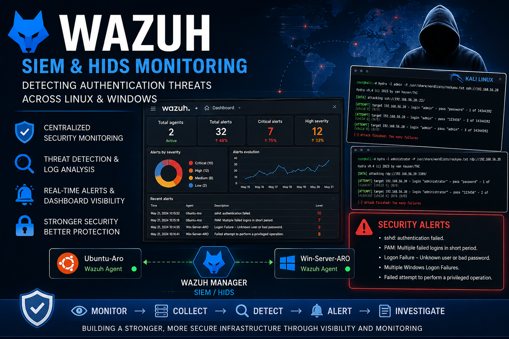

# ⭐ Featured Projects

Welcome to my project portfolio. These projects demonstrate my experience in business intelligence, cloud computing, systems administration, cybersecurity, web development, and enterprise IT solutions. Each project reflects my commitment to solving real business problems through technology while continuously developing my technical and professional skills.

---

## 📊 Business Intelligence

  

### Fleet Operations Dashboard for MALCO Transport Limited

Developed an interactive Business Intelligence solution that transforms fleet operational data into actionable insights for management through executive dashboards and KPI reporting.

**Key Technologies**

Power BI • Tableau • Excel • Power Query • DAX • SQL

**[Explore This Project →](business-intelligence/malco-dashboard/README.md)**

---

## 🐧 Systems Administration

  

### Enterprise Linux Infrastructure Deployment

Designed and deployed a secure Ubuntu Server infrastructure on AWS, implementing enterprise Linux administration, storage management, network services, and security best practices.

**Key Technologies**

Ubuntu Server • AWS EC2 • Apache2 • Bind9 DNS • LVM • SSH • UFW

**[Explore This Project →](systems-administration/linux-infrastructure/README.md)**

---

## 🌍 Web Development

  

### African Market Online Store

Managed and developed a professional website for Ouelessebougou Alliance to promote African artisans and expand the organization's digital presence.

**Key Technologies**

Squarespace • Website Design • Project Management

**[Explore This Project →](web-development/ouelessebougou-alliance/README.md)**

---

## 🎮 Interactive Learning

  

### AWS Cloud Hero Quiz

Designed an interactive PowerPoint-based game that helps learners prepare for the AWS Certified Cloud Practitioner examination through engaging, scenario-based quizzes.

**Key Technologies**

Microsoft PowerPoint • AWS Fundamentals • Interactive Learning

**[Explore This Project →](interactive-projects/aws-cloud-hero-quiz/README.md)**

---

## ☁️ Cloud Computing

  

### Jumia Nigeria Hybrid Cloud Solution

Designed a secure, scalable, and cost-effective hybrid cloud architecture for one of Africa's leading e-commerce companies using Amazon Web Services (AWS).

**Key Technologies**

AWS • EC2 • VPC • IAM • CloudFront • Elastic Load Balancer • Disaster Recovery

**[Explore This Project →](cloud-computing/jumia-hybrid-cloud-solution/README.md)**

---

## 🛡️ Cybersecurity

  

### Enterprise Security Monitoring with Wazuh

Implemented a centralized Security Information and Event Management (SIEM) environment using Wazuh to monitor Linux and Windows endpoints, analyze security events, detect authentication failures, and support threat investigation.

**Key Technologies**

Wazuh • Linux • Windows Server • Kali Linux • SIEM • HIDS

**[Explore This Project →](cybersecurity/wazuh-security-monitoring/README.md)**

---

## 🧭 Portfolio Navigation

🏠 [Home](../README.md)
