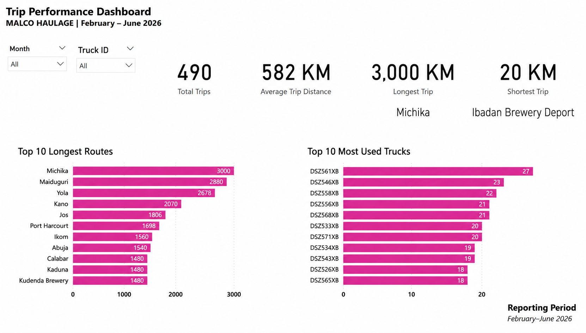
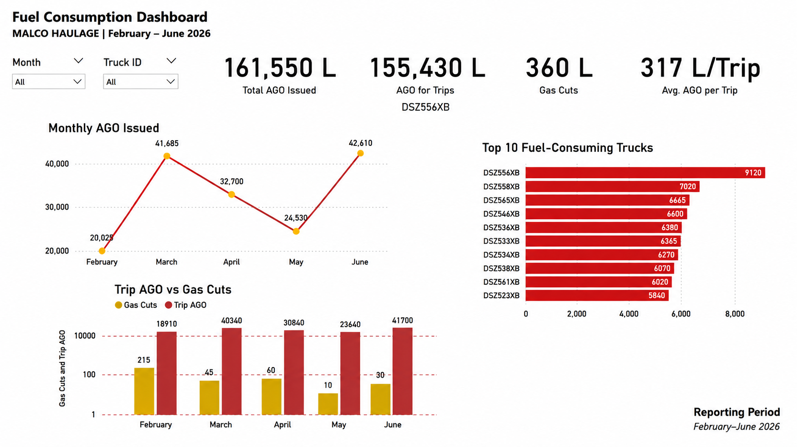
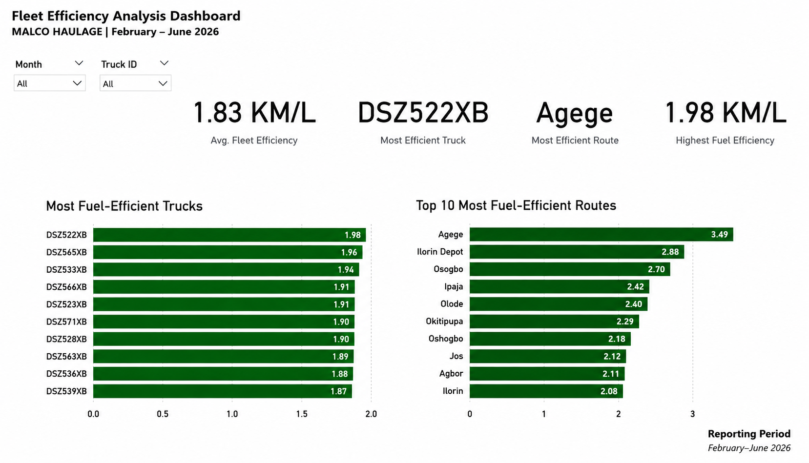

# Business Intelligence Dashboard for Fleet Performance & Fuel Analytics at MALCO HAULAGE


> **Designed and developed an end-to-end Business Intelligence solution that transforms operational fleet data into interactive dashboards, enabling data-driven decision-making for fleet performance, fuel consumption, and operational efficiency at MALCO HAULAGE.**

---

| **Project Information** | **Details** |
|-------------------------|-------------|
| **Project Type** | End-to-End Business Intelligence Solution |
| **Role** | Business Intelligence Analyst |
| **Industry** | Logistics & Transportation |
| **Data Source** | Operational Fleet Dispatch Records (February–June 2026) |
| **Database** | PostgreSQL |
| **Visualization Tool** | Microsoft Power BI |
| **Supporting Tools** | Microsoft Excel, Power Query |
| **Project Status** | Completed |
| **Focus Areas** | Fleet Performance, Fuel Analytics, Route Analysis, Operational Efficiency |
| **Skills Applied** | SQL, PostgreSQL, DAX, Data Modeling, Dashboard Design, KPI Development, Business Analytics |

---

## 📌 Project Highlights

- Designed and developed **4 interactive Power BI dashboards**.
- Analyzed **490 fleet trips** using PostgreSQL and SQL.
- Created **DAX measures** to calculate KPIs and fuel efficiency metrics.
- Built an end-to-end Business Intelligence workflow from raw operational data to executive dashboards.
- Delivered business insights to support fleet performance, fuel management, and operational decision-making.

---

## 📋 Executive Summary

This project presents an end-to-end Business Intelligence solution developed to improve operational visibility and support data-driven decision-making for MALCO HAULAGE, a logistics and transportation company.

Operational dispatch data covering February through June 2026 was imported into PostgreSQL, where SQL queries were used to analyze fleet performance, fuel consumption, trip activity, and route efficiency. The processed data was then connected to Microsoft Power BI, where Power Query, data modeling, and DAX measures were used to create interactive dashboards and executive reports.

The solution delivers four dashboards that answer key business questions related to fleet operations:

- Executive Overview
- Trip Performance
- Fuel Consumption
- Fleet Efficiency Analysis

Together, these dashboards enable management to monitor operational KPIs, evaluate fuel usage, identify high-performing trucks and routes, and support faster, evidence-based decision-making.

This project demonstrates my ability to manage the complete Business Intelligence workflow—from data preparation and SQL analysis to dashboard development and business storytelling.

---

## 🎯 Business Challenge

MALCO HAULAGE generates operational dispatch records every day, capturing information such as dispatch dates, truck assignments, destinations, fuel (AGO) issued, and distance travelled. Although this data is valuable for monitoring fleet performance, it was stored as operational records that provided limited visibility into business performance and operational trends.

Management needed a reporting solution capable of transforming raw dispatch data into meaningful insights that could answer important business questions, including:

- How many trips were completed during the reporting period?
- How far did the fleet travel?
- How much AGO was issued for operations?
- Which trucks consumed the most fuel?
- Which routes required the longest travel distances?
- Which trucks and routes operated most efficiently?

Without an interactive reporting system, answering these questions required manual calculations and spreadsheet analysis, making decision-making slower and limiting management's ability to identify operational trends.

The objective of this project was to design a Business Intelligence solution that transforms operational dispatch records into interactive dashboards that support faster, more informed, and data-driven decision-making.

---

## 🏗️ Solution Architecture

```text
                Fleet Dispatch Records (CSV)
                           │
                           ▼
                    PostgreSQL Database
                           │
                           ▼
                   SQL Data Analysis
                           │
                           ▼
            Power Query (Data Preparation)
                           │
                           ▼
          Data Modeling & DAX Measures
                           │
                           ▼
              Microsoft Power BI Reports
                           │
                           ▼
     Interactive Dashboards & Business Insights
```

### Architecture Overview

Monthly fleet dispatch records covering February through June 2026 were imported into a PostgreSQL database, where SQL queries were used to explore operational performance and answer key business questions. The dataset was then connected to Microsoft Power BI, where Power Query was used for data preparation and transformation.

A dedicated calendar table and DAX measures were created to support time-based analysis, KPI calculations, and interactive filtering. The completed data model powers four interactive dashboards that provide management with actionable insights into fleet performance, fuel consumption, trip activity, and operational efficiency.

---

## 📊 Dashboard Overview

The Business Intelligence solution consists of four interactive dashboards, each designed to answer specific business questions and support operational decision-making.

#### 1. Executive Overview Dashboard

Provides a high-level summary of fleet operations through key performance indicators (KPIs), including total trips, total distance travelled, AGO issued, fuel efficiency, and monthly operational trends.

#### 2. Trip Performance Dashboard

Analyzes fleet activity by highlighting average trip distance, longest and shortest routes, most frequently used trucks, and the longest operational routes during the reporting period.

#### 3. Fuel Consumption Dashboard

Monitors AGO usage through fuel consumption trends, average fuel issued per trip, gas cuts, and identifies the trucks with the highest fuel consumption.

#### 4. Fleet Efficiency Analysis Dashboard

Evaluates operational efficiency by comparing fuel efficiency across trucks and routes, enabling management to identify high-performing assets and opportunities for operational improvement.

---

## 🛠️ Technologies Used

| Technology | Purpose |
|------------|---------|
| **PostgreSQL** | Storing and querying operational dispatch data |
| **SQL** | Data exploration, KPI calculations, and business analysis |
| **Microsoft Power BI** | Interactive dashboard development and business reporting |
| **Power Query** | Data cleaning and transformation |
| **DAX (Data Analysis Expressions)** | Creating calculated measures and KPIs |
| **Data Modeling** | Building relationships between tables and supporting time-based analysis |
| **Microsoft Excel** | Preparing and importing monthly dispatch records |
| **Tableau** | Knowledge of dashboard implementation using an alternative BI platform |

---

## ❓ Business Questions Answered

The Business Intelligence solution was designed to answer practical business questions that support fleet management and operational decision-making.

#### Executive Overview

- How many trips were completed?
- How far did the fleet travel?
- How much AGO was issued?
- What is the fleet's average fuel efficiency?
- How did operational performance change over time?

#### Trip Performance

- Which routes recorded the longest travel distances?
- Which trucks completed the most trips?
- What was the average trip distance?
- What were the longest and shortest trips?

#### Fuel Consumption

- How much AGO was consumed for operational trips?
- How much fuel was issued as gas cuts?
- Which trucks consumed the most fuel?
- How did fuel consumption change each month?

#### Fleet Efficiency Analysis

- Which trucks achieved the highest fuel efficiency?
- Which routes demonstrated the best fuel efficiency?
- Which operational areas may require further investigation?

---

## 📷 Dashboard Screenshots

#### Executive Overview Dashboard


Provides executives with a high-level summary of fleet performance through key operational KPIs, monthly trends, and destination analysis.

---

#### Trip Performance Dashboard



Analyzes fleet operations by highlighting trip statistics, longest routes, and the most frequently utilized trucks.

---

#### Fuel Consumption Dashboard



Monitors AGO usage, gas cuts, monthly fuel trends, and identifies trucks with the highest fuel consumption.

---

#### Fleet Efficiency Analysis Dashboard



Evaluates truck and route fuel efficiency to identify high-performing assets and support operational improvement.

---

## 📈 Results & Business Impact

The completed Business Intelligence solution transformed operational fleet dispatch records into a centralized reporting platform that enables management to monitor fleet performance, fuel consumption, and operational efficiency from a single source of truth.

By integrating PostgreSQL, SQL analysis, Power BI, and DAX, the solution eliminates the need for manual spreadsheet analysis while providing interactive dashboards that support faster and more informed decision-making.

### Business Impact

✔ Centralized operational reporting across four interactive dashboards

✔ Improved visibility into fleet performance and fuel consumption

✔ Reduced manual analysis through automated KPI calculations

✔ Enabled trend analysis across multiple reporting periods

✔ Supported data-driven decision-making using interactive filtering and drill-down capabilities

✔ Identified high-performing trucks and fuel-efficient routes

✔ Improved monitoring of fuel usage, gas cuts, and operational efficiency

Overall, this project demonstrates how Business Intelligence can transform raw operational data into actionable insights that improve reporting efficiency and operational decision-making.

---

## 💡 Skills Demonstrated

This project demonstrates my ability to design and deliver an end-to-end Business Intelligence solution by combining database technologies, data analysis, and interactive reporting.

### Database & Querying

- PostgreSQL
- SQL Query Development
- Data Extraction
- Business Query Analysis

### Business Intelligence

- Microsoft Power BI
- Dashboard Design
- KPI Development
- DAX Measures
- Power Query
- Data Modeling
- Interactive Reporting

### Data Analytics

- Fleet Performance Analysis
- Fuel Consumption Analysis
- Trend Analysis
- Route Performance Analysis
- Operational Efficiency Analysis
- Business Storytelling

### Professional Skills

- Analytical Thinking
- Problem Solving
- Business Process Analysis
- Decision Support
- Data Visualization
- Technical Documentation

---

## 📚 Lessons Learned

This project strengthened my understanding of the complete Business Intelligence lifecycle, from data preparation and SQL analysis to dashboard development and business reporting.

One of the most valuable lessons I learned was that effective dashboards begin with understanding business questions rather than selecting charts. Every visualization should answer a specific management question and provide insights that support operational decision-making.

The project also reinforced the importance of clean data, well-designed data models, and meaningful KPIs. Working with PostgreSQL, SQL, Power Query, DAX, and Power BI gave me practical experience in transforming operational data into interactive dashboards that communicate clear business insights.

Overall, this project enhanced both my technical Business Intelligence skills and my ability to translate operational data into information that supports strategic decision-making.

---

## 🚀 Future Improvements

While the current Business Intelligence solution provides valuable operational insights, several enhancements could further increase its business value and scalability.

Potential future improvements include:

- Integrate live data from a Fleet Management System (FMS) or Enterprise Resource Planning (ERP) platform.
- Automate data refreshes using scheduled Power BI refresh or cloud-based ETL processes.
- Expand the data model to include vehicle maintenance, driver performance, and operating costs.
- Develop predictive analytics to forecast fuel consumption and maintenance requirements.
- Incorporate GPS and route optimization data to evaluate route efficiency and travel time.
- Publish dashboards through Microsoft Power BI Service with role-based access for management.
- Build executive mobile dashboards for real-time operational monitoring.
- Implement AI-driven anomaly detection to identify unusual fuel consumption or operational trends.

These enhancements would further improve reporting automation, operational visibility, and strategic decision-making while supporting the organization's long-term digital transformation.

---

## 🧭 Portfolio Navigation

← [Back to Projects](../README.md)

🏠 [Home](../../README.md)

👤 [About Me](../../about/README.md)

💼 [Professional Experience](../../experience/README.md)

🛠️ [Technical Skills](../../skills/README.md)
