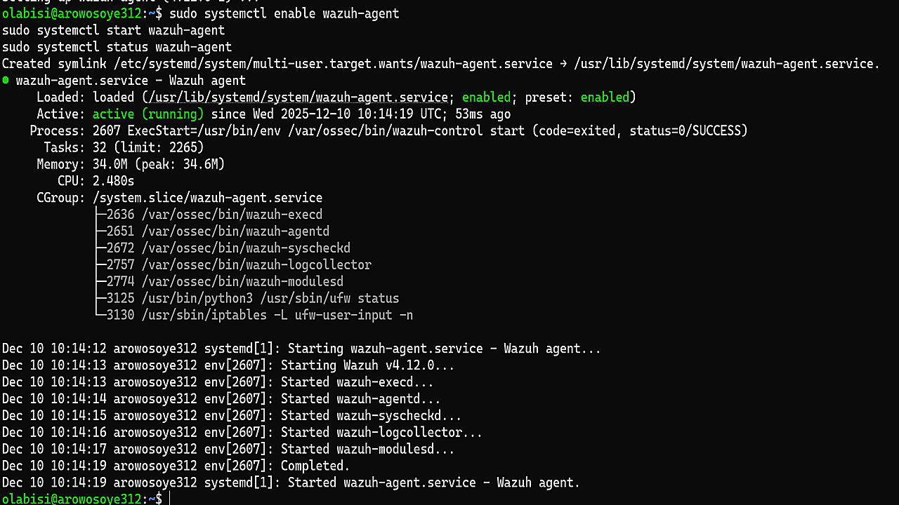
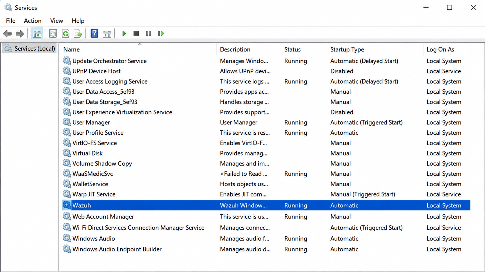
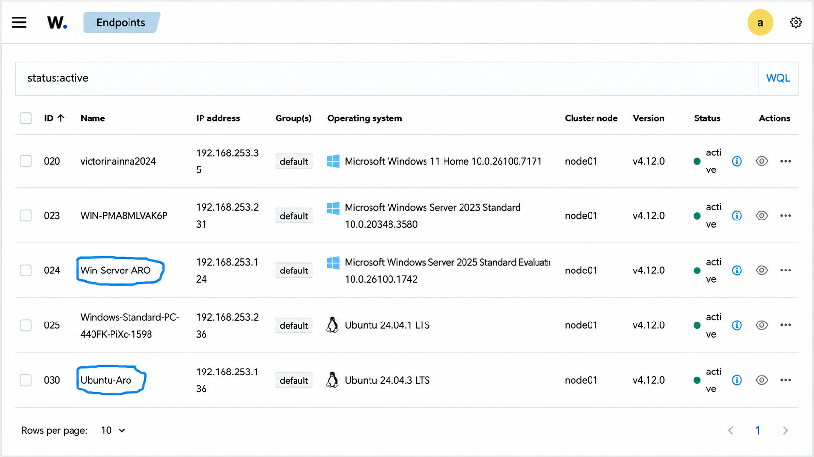
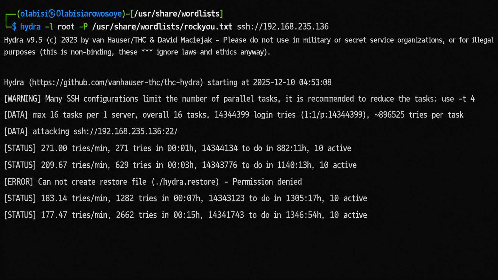
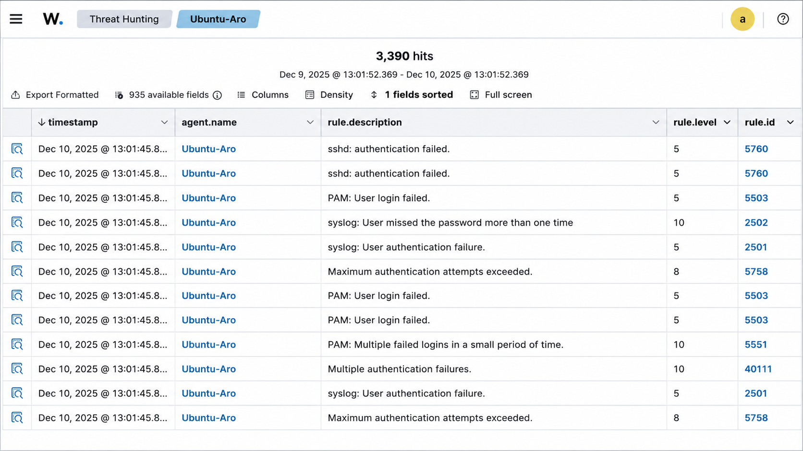
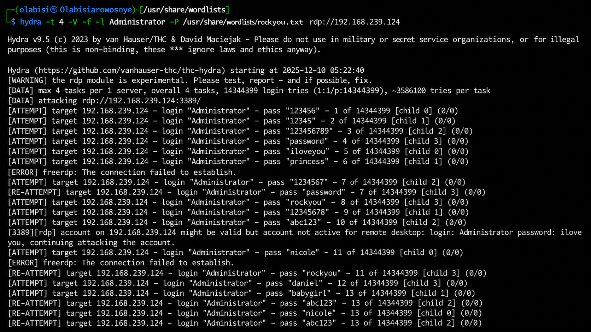
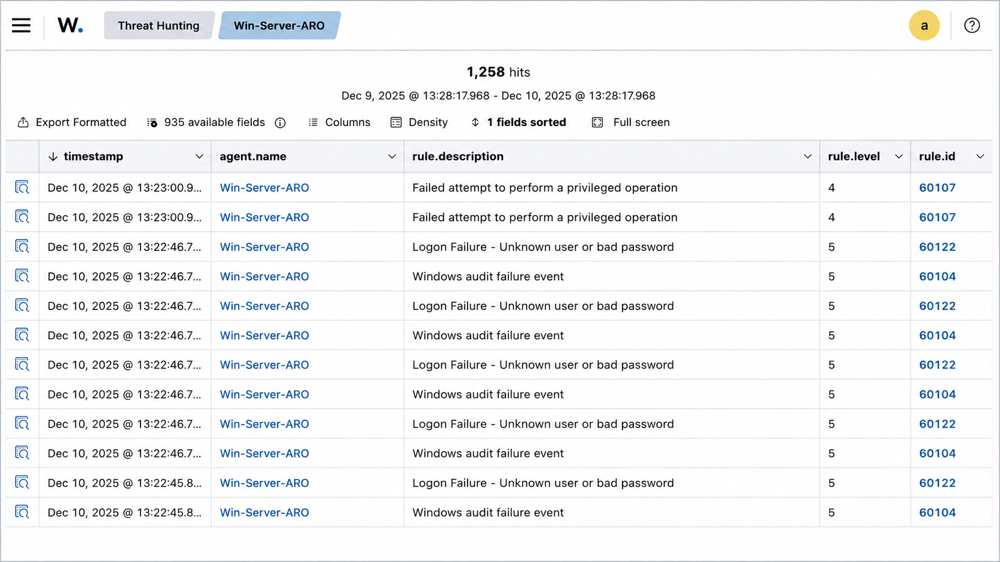

# 🛡️ Enterprise Security Monitoring with Wazuh

> **Designing and implementing an enterprise security monitoring environment with Wazuh to collect security events, detect authentication failures, monitor endpoints, and demonstrate security alerting and threat detection in a controlled laboratory environment.**

---

## 📋 Project Information

| **Detail** | **Information** |
|---|---|
| **Project Type** | Enterprise Security Monitoring & SIEM |
| **Role** | Security Monitoring / Systems Administrator |
| **Security Platform** | Wazuh |
| **SIEM Function** | Log Analysis, Threat Detection & Security Monitoring |
| **Endpoint Systems** | Ubuntu Server & Windows Server |
| **Testing System** | Kali Linux |
| **Environment** | Controlled Virtual Lab |
| **Project Status** | Completed |
| **Primary Focus** | SIEM, HIDS, Log Analysis, Threat Detection & Incident Response |
| **Skills Applied** | Wazuh, Linux, Windows Server, Security Monitoring, Authentication Analysis, Threat Detection |

---

## 🚀 Executive Summary

This project demonstrates the deployment and use of Wazuh as an enterprise Security Information and Event Management (SIEM) and Host-based Intrusion Detection System (HIDS) platform.

The environment was designed to monitor both Ubuntu and Windows Server endpoints, collect security-related events, and provide centralized visibility into authentication failures, privileged-operation failures, and other suspicious activity.

Wazuh agents were installed and configured on the endpoint systems and connected to the Wazuh Manager. The resulting security events were analyzed through the Wazuh dashboard, demonstrating how centralized monitoring can identify repeated authentication failures and other indicators of potentially malicious activity.

The project also included controlled security testing using Kali Linux to generate authentication-failure events against the laboratory systems. These activities demonstrated how repeated login attempts can be detected and surfaced through a SIEM platform.

### 🔐 Controlled Laboratory Environment

> **Important:** This project was performed entirely within a contained and controlled virtual laboratory environment specifically established for educational purposes under the supervision of the Ensign College IT department.
>
> All virtual machines used in this project were created and configured by me specifically for my coursework and security labs. They were not personal computers or systems belonging to other individuals or organizations.
>
> As a student, I agreed to follow Ensign College's academic and ethical requirements and not engage in malicious cyber activity against unauthorized systems. The dictionary-based authentication testing and other security concepts demonstrated in this project were conducted strictly for educational purposes.
>
> The purpose of these demonstrations is to understand how security monitoring systems identify suspicious authentication activity and to highlight defensive practices such as strong password policies, account protection, authentication monitoring, and login rate-limiting. They are not intended for unauthorized access or harmful purposes.

---

## 🏗️ Security Monitoring Architecture

The solution uses Wazuh as the central security monitoring platform, collecting and analyzing security events from multiple endpoint systems within the controlled laboratory environment.

The architecture consists of a Wazuh Manager, monitored Ubuntu and Windows Server endpoints, and a Kali Linux testing system used to generate controlled authentication activity. Wazuh agents installed on the monitored endpoints collect relevant security events and forward them to the Wazuh Manager for centralized analysis.

### Architecture Flow

<pre>
                         🔐 Controlled Virtual Lab
                                  │
                                  ▼
                       ┌─────────────────────┐
                       │    Wazuh Manager    │
                       │   SIEM / HIDS Core  │
                       │                     │
                       │ • Log Analysis      │
                       │ • Threat Detection  │
                       │ • Alert Generation  │
                       │ • Security Events   │
                       └──────────┬──────────┘
                                  │
                    ┌─────────────┴─────────────┐
                    │                           │
                    ▼                           ▼
          ┌──────────────────┐       ┌──────────────────┐
          │   Ubuntu Server  │       │  Windows Server  │
          │   Ubuntu-Aro      │       │  Win-Server-ARO  │
          │                  │       │                  │
          │ Wazuh Agent     │       │ Wazuh Agent      │
          │ SSH Monitoring  │       │ Windows Events   │
          │ System Logs     │       │ Logon Monitoring │
          └────────┬─────────┘       └────────┬─────────┘
                   │                          │
                   └────────────┬─────────────┘
                                │
                                ▼
                       📊 Security Events
                                │
                                ▼
                    ┌─────────────────────┐
                    │ Threat Detection &  │
                    │ Security Analysis   │
                    └─────────────────────┘
                                ▲
                                │
                    ┌───────────┴───────────┐
                    │                       │
                    │  Controlled Testing   │
                    │                       │
                    ▼                       ▼
             🐉 Kali Linux            🔑 Authentication
             Security Testing         Event Generation
</pre>

#### Core Components

| **Component** | **Purpose** |
|---|---|
| **Wazuh Manager** | Central platform for collecting, analyzing, and correlating security events |
| **Wazuh Agent** | Collects security and system events from monitored endpoints |
| **Ubuntu-Aro** | Linux endpoint monitored for authentication and system security events |
| **Win-Server-ARO** | Windows Server endpoint monitored for Windows security and authentication events |
| **Kali Linux** | Controlled testing system used to generate authentication activity |
| **Wazuh Dashboard** | Provides centralized visibility into alerts, agents, and security events |

---

## ⚙️ Environment & Wazuh Deployment

The security monitoring environment was built using virtual machines created specifically for the project. Wazuh agents were deployed on both Linux and Windows endpoints so that security events from different operating systems could be monitored from a centralized platform.

#### 🐧 Ubuntu Wazuh Agent

The Wazuh agent was installed on the Ubuntu endpoint and configured to run as a system service. The service was enabled to start automatically and was verified as **active (running)**.

The following evidence confirms the successful activation of the Wazuh agent:

  

  <em>Screenshot showing the Ubuntu Wazuh agent service running, confirming successful installation and activation.</em>

#### 🪟 Windows Wazuh Agent

A Wazuh agent was also installed on the Windows Server endpoint. The Windows Services console was used to verify that the **Wazuh** service was running and configured for automatic startup.

  

  <em>Screenshot showing the Wazuh agent successfully installed and running as a Windows service, confirming that the HIDS agent is active.</em>

 
#### 📡 Endpoint Verification

After configuring the agents, the Wazuh dashboard was used to verify that the monitored endpoints were successfully connected.

Both **Win-Server-ARO** and **Ubuntu-Aro** appear in the Active Agents section with an **Active** status.

  

> **Screenshot showing Win-Server-ARO and Ubuntu-Aro listed as active endpoints in the Wazuh dashboard.**

This confirms that the monitoring infrastructure was operational and that security events from both Windows and Linux environments could be collected for centralized analysis.

---

## 🔍 Security Testing & Threat Detection

To validate the monitoring environment, controlled authentication testing was performed against the laboratory endpoints from the Kali Linux virtual machine.

The purpose of the testing was not to gain unauthorized access, but to generate realistic security events that could be observed and analyzed by Wazuh. This provided an opportunity to evaluate whether the SIEM could detect repeated authentication failures and distinguish suspicious activity from normal system events.

### 🐧 Controlled SSH Authentication Testing

A controlled SSH dictionary-based authentication test was performed against the Ubuntu endpoint using Hydra. The test generated repeated SSH authentication attempts, providing Wazuh with security events that could be analyzed for suspicious login behavior.

  

> **Screenshot showing the controlled Hydra SSH authentication test running from the Kali Linux laboratory environment.**

The generated authentication failures were subsequently captured by the Wazuh agent running on the Ubuntu endpoint and forwarded to the Wazuh Manager for analysis.

### 📊 Wazuh SSH Security Alerts

The Wazuh Security Events interface was then examined to determine whether the authentication activity had been detected.

  

> **Screenshot showing Wazuh security events associated with SSH authentication failures and multiple failed login attempts.**

The alerts included events such as **“sshd: authentication failed”** and **“PAM: Multiple failed logins in short period,”** demonstrating that the activity generated recognizable security events within the SIEM. :contentReference[oaicite:0]{index=0}

---

## 🪟 Windows RDP Security Testing

A second controlled authentication test was performed against the Windows Server endpoint using Hydra's RDP module.

The objective was to determine whether unsuccessful RDP authentication attempts would generate Windows security events that could be collected and analyzed by Wazuh.

  

> **Screenshot showing the controlled Hydra RDP authentication test running against the Windows Server laboratory endpoint.**

The unsuccessful authentication attempts generated Windows security events that were subsequently collected by the Wazuh agent and analyzed by the Wazuh Manager.

#### 🛡️ Wazuh Windows Security Alerts

The Wazuh dashboard was used to investigate the events generated during the controlled RDP testing.

  

> **Screenshot showing Wazuh alerts for Windows logon failures and failed privileged operations.**

The detected Windows events included **“Logon Failure – Unknown user or bad password”** and **“Multiple Windows Logon Failures.”** The project documentation also records a **failed attempt to perform a privileged operation** among the Windows alerts. :contentReference[oaicite:1]{index=1}

Together, these results demonstrate the complete monitoring workflow:

**Controlled Authentication Activity → Endpoint Security Events → Wazuh Agent → Wazuh Manager → Security Alerts → Investigation**

---

## 📈 Detection Results & Security Analysis

The testing confirmed that the Wazuh monitoring environment successfully collected and analyzed security events generated on both monitored endpoints.

### 🐧 Ubuntu Detection Results

The SSH authentication testing generated multiple security events on the Ubuntu endpoint. Wazuh identified authentication failures and repeated login attempts, including:

- **sshd: authentication failed**
- **Maximum authentication attempts exceeded**
- **PAM: Multiple failed logins in a short period**

These alerts demonstrate how repeated authentication failures can provide an early indicator of a potential brute-force or credential-guessing attempt. :contentReference[oaicite:0]{index=0}

### 🪟 Windows Detection Results

The RDP authentication testing generated corresponding Windows security events that were collected by the Wazuh agent and analyzed by the SIEM.

The detected events included:

- **Logon Failure – Unknown user or bad password**
- **Multiple Windows Logon Failures**
- **Failed attempt to perform a privileged operation**

These events demonstrate Wazuh's ability to provide centralized visibility into Windows authentication and security activity. :contentReference[oaicite:1]{index=1}

---

## 🧠 Security Analysis

The results demonstrate the value of centralized security monitoring in an enterprise environment.

Without a SIEM platform, authentication failures occurring across different servers could be difficult to identify and correlate. Wazuh provides a centralized view of endpoint activity, allowing administrators to investigate suspicious patterns across Linux and Windows systems.

The project demonstrated the following security-monitoring capabilities:

| **Capability** | **Demonstrated Result** |
|---|---|
| **Endpoint Monitoring** | Ubuntu and Windows endpoints successfully connected to Wazuh |
| **Log Collection** | Security and authentication events were collected from monitored systems |
| **Authentication Monitoring** | Failed SSH and Windows logon attempts were detected |
| **Threat Detection** | Repeated authentication failures generated security alerts |
| **Alert Classification** | Wazuh categorized events according to predefined detection rules |
| **Centralized Visibility** | Events from multiple operating systems were available through one monitoring platform |
| **Security Investigation** | Generated alerts could be reviewed and analyzed through the Wazuh dashboard |

The sample alerts recorded during the project included severity levels ranging from **5 to 10**, demonstrating how Wazuh classified different security events according to its predefined rules. :contentReference[oaicite:2]{index=2}

The testing therefore demonstrated a complete security-monitoring cycle:

**Monitor → Collect → Detect → Alert → Investigate**

---

## 🛡️ Defensive Security Lessons

The controlled testing also highlighted several important defensive practices for protecting enterprise systems against credential-based attacks.

#### 🔐 Strong Authentication

Complex passwords and strong authentication policies reduce the likelihood of successful credential-guessing attacks.

#### ⏱️ Login Rate Limiting

Limiting repeated authentication attempts can slow automated credential attacks and reduce the number of attempts an attacker can make within a given period.

#### 👁️ Continuous Monitoring

Centralized monitoring allows security teams to identify repeated authentication failures and investigate suspicious behavior before it develops into a larger security incident.

#### 🔒 Least Privilege

Restricting administrative privileges limits the potential impact of compromised accounts and reduces unnecessary access to sensitive system resources.

#### 📊 Centralized Security Visibility

A SIEM such as Wazuh provides a unified view of security activity across multiple operating systems, making it easier to identify patterns that might otherwise remain isolated on individual systems.

The project demonstrates that security monitoring is not only about detecting attacks after they occur. It is also about creating visibility that enables organizations to identify weaknesses, improve controls, and respond before unauthorized access occurs.

---

## 📊 Results & Business Value

The completed project demonstrated that Wazuh can provide centralized security visibility across both Linux and Windows environments within a controlled laboratory infrastructure.

The implementation successfully achieved the primary monitoring goals:

- **Deployed HIDS agents** on Ubuntu and Windows Server endpoints.
- **Registered and monitored active endpoints** through the Wazuh dashboard.
- **Collected authentication and security events** from both operating systems.
- **Detected repeated authentication failures** generated during controlled security testing.
- **Generated and categorized security alerts** based on predefined Wazuh detection rules.
- **Provided centralized visibility** for investigating security events across multiple endpoints.

The project demonstrates how organizations can use SIEM and HIDS technologies to improve security awareness, identify suspicious authentication activity, and support incident investigation.

From a business perspective, centralized monitoring can help security teams reduce the time required to identify suspicious activity, improve visibility across distributed systems, and strengthen preventive security controls.

---

## 🧠 Lessons Learned

This project strengthened my understanding of how endpoint security monitoring and SIEM platforms work together to detect and investigate suspicious activity.

One of the most important lessons I learned was that **security visibility is essential for effective defense**. Authentication failures occurring on individual systems can easily become difficult to identify when there is no centralized monitoring platform. Wazuh provided a single location where events from both Linux and Windows endpoints could be reviewed and analyzed.

I also learned how different operating systems generate different security events and how a SIEM can normalize and correlate these events to provide a broader security perspective.

The controlled testing further demonstrated why organizations should implement strong password policies, authentication monitoring, account protection, least-privilege access, and login rate-limiting controls.

Most importantly, this project reinforced the principle that cybersecurity should be approached from a **defensive and ethical perspective**. Understanding how attacks generate observable indicators helps security professionals build stronger controls for detecting and mitigating those threats.

---

## 🏆 Key Achievements

- Deployed and configured Wazuh HIDS agents on **Ubuntu Server and Windows Server**.
- Successfully registered and verified both endpoints in the **Wazuh Manager**.
- Established centralized security monitoring through the **Wazuh SIEM dashboard**.
- Generated controlled authentication activity within an isolated laboratory environment.
- Successfully detected SSH authentication failures on the Ubuntu endpoint.
- Successfully detected Windows logon failures and privileged-operation events.
- Analyzed security alerts and their associated severity levels.
- Demonstrated the complete security-monitoring workflow from **event generation to detection and investigation**.
- Applied cybersecurity concepts in an ethical, controlled, and educational environment.

---

## 🧭 Portfolio Navigation

← [Back to Projects](../../README.md)

🏠 [Home](../../../README.md)

👤 [About Me](../../../about/README.md)
