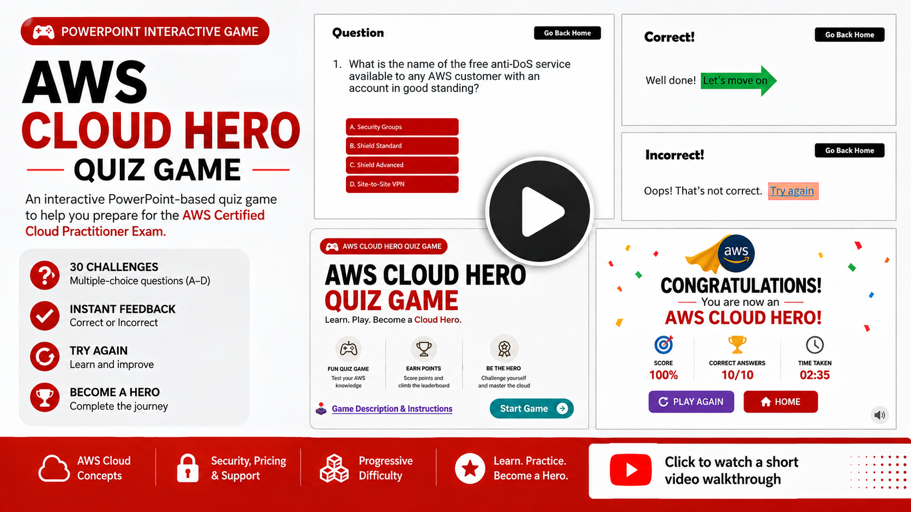

# 🎮 AWS Cloud Hero Quiz Game

**An interactive PowerPoint-based learning game designed to help learners prepare for the AWS Certified Cloud Practitioner exam through challenges, immediate feedback, and progressive difficulty.**

---
---

## 📋 Project Information

| **Details** | **Information** |
|---|---|
| **Project Type** | Interactive Learning Game |
| **Project Title** | AWS Cloud Hero Quiz Game |
| **Format** | Interactive PowerPoint Game |
| **Role** | Game Designer & Developer |
| **Primary Focus** | AWS Cloud Learning & Exam Preparation |
| **Questions** | 30 Multiple-Choice Challenges |
| **Question Format** | Four Options (A–D) |
| **Feedback System** | Correct / Incorrect Navigation |
| **Difficulty** | Progressive |
| **Cloud Topics** | AWS Services, Security, Pricing & Support |
| **Project Status** | Completed |

---
## 🎯 Executive Summary

The **AWS Cloud Hero Quiz Game** is an interactive PowerPoint-based learning experience designed to help learners prepare for the **AWS Certified Cloud Practitioner exam** in a fun, engaging, and accessible way.

The game contains **30 multiple-choice questions** organized as challenges along a simulated journey through **“Cloud Kingdom.”** Players select from four answer options and immediately receive feedback based on their responses.

A correct answer takes the player to a **“Correct!”** screen with praise and a **“Let's move on”** option. An incorrect answer leads to an **“Incorrect”** screen with a **“Try again”** option that returns the player to the question.

The game covers AWS-related topics including **cloud services, security, pricing, and support**, while using custom navigation, visual feedback, and progressive difficulty to create a more engaging learning experience.

The final challenge leads to a **“Congratulations”** screen, completing the player's journey and recognizing them as an **AWS Cloud Hero**.

---

## 🧩 Business Challenge

Preparing for a cloud certification exam can become repetitive when learning relies primarily on reading notes, reviewing terminology, and answering conventional practice questions.

This project addressed that challenge by turning AWS Cloud Practitioner preparation into an interactive learning experience. Instead of simply presenting questions and answers, the game uses a simulated journey, immediate feedback, navigation, and progressive challenges to make the learning process more engaging.

The game was designed to:

- Make AWS exam preparation more interactive and enjoyable.
- Reinforce AWS concepts through repeated question-based challenges.
- Provide immediate feedback after each response.
- Allow learners to retry incorrect answers.
- Gradually increase the difficulty as the player progresses.
- Provide a clear sense of completion through the final **AWS Cloud Hero** achievement.

---

## 🎮 Game Design & Gameplay

The game is structured as a simulated journey through **“Cloud Kingdom,”** where each question represents a challenge on the path to becoming an AWS Cloud Hero.

#### 🏁 Start

Players begin the experience by selecting the **“Start Game”** button.

#### ❓ Challenge

Each challenge presents a multiple-choice AWS question with four possible answers labeled **A–D**.

#### ✅ Correct Answer

When the player selects the correct answer, the game displays a **“Correct!”** screen with positive feedback and a **“Let's move on”** button that advances the player to the next challenge.

#### ❌ Incorrect Answer

When an incorrect option is selected, the game displays an **“Incorrect”** screen with a **“Try again”** button. Selecting it returns the player to the question so they can attempt it again.

#### 🏆 Completion

The process continues through all **30 challenges**. After the final question, the player reaches a **“Congratulations”** screen recognizing them as an **AWS Cloud Hero**.

This navigation structure creates a simple feedback loop:

**Question → Answer → Feedback → Retry or Continue → Next Challenge**

---

## ⭐ Project Highlights

- 🎮 **30 AWS Challenges** — Created a complete 30-question interactive quiz experience.
- ☁️ **AWS-Focused Learning** — Covered cloud services, security, pricing, and support concepts.
- 🔄 **Interactive Navigation** — Connected questions, feedback screens, retry options, and progression buttons.
- ✅ **Immediate Feedback** — Players receive instant confirmation after each answer.
- 🔁 **Retry Mechanism** — Incorrect answers return the player to the question for another attempt.
- 📈 **Progressive Difficulty** — Challenges become progressively more difficult throughout the experience.
- 🏆 **Gamified Completion** — The final challenge leads to a congratulatory AWS Cloud Hero achievement.
- 💻 **Accessible Format** — Designed as a PowerPoint-based game without requiring an AWS account or specialized software.
- 🎥 **Walkthrough Demonstration** — A short video demonstrates selected gameplay stages, including Questions 1, 2, 5, the final Question 30, and the Congratulations screen.

---

## ⚙️ Implementation Process

The game was developed as an interactive PowerPoint experience using custom navigation and linked screens to create a game-like learning flow.

#### Phase 1 — Content & Question Design

- Developed 30 multiple-choice AWS challenges.
- Organized questions around AWS cloud services, security, pricing, and support.
- Structured the questions to support progressive difficulty.
- Created four answer choices (A–D) for each challenge.

#### Phase 2 — Interactive Navigation

- Created a **Start Game** entry point.
- Connected answer choices to the appropriate feedback screens.
- Created separate **Correct** and **Incorrect** response pages.
- Added **Let's move on** navigation for correct answers.
- Added **Try again** navigation for incorrect answers.
- Connected the final challenge to the **Congratulations** screen.

#### Phase 3 — Testing & Refinement

- Tested the navigation flow between questions and feedback screens.
- Verified that correct answers progressed appropriately.
- Verified that incorrect answers returned players to the relevant question.
- Reviewed the complete 30-question journey for continuity.

#### Phase 4 — Demonstration

A short walkthrough was recorded to demonstrate selected parts of the completed game, including Questions 1, 2, 5, Question 30, and the final Congratulations screen.

---

## 🛠️ Technologies & Tools

| **Tool / Technology** | **Purpose** |
|---|---|
| **Microsoft PowerPoint** | Game development, visual design, slide navigation, and interactive elements |
| **AWS Cloud Concepts** | Subject matter for the quiz challenges |
| **Hyperlinks / Slide Navigation** | Connected questions, answers, feedback, retry, and progression |
| **Multimedia & Visual Design** | Created an engaging game-like learning experience |

---

## 💡 Skills Demonstrated

This project demonstrates my ability to combine technical knowledge, instructional design, creativity, and problem-solving to create an interactive technology-based learning experience.

#### ☁️ Technical Skills

- AWS Cloud Concepts
- Cloud Services Knowledge
- Cloud Security Concepts
- Cloud Pricing & Support Concepts
- Interactive PowerPoint Development
- Presentation Design
- Hyperlink & Navigation Design
- Multimedia Integration

#### 🎨 Creative & Problem-Solving Skills

- Gamification
- Interactive Learning Design
- User Experience Thinking
- Information Organization
- Visual Communication
- Creative Problem Solving
- Testing & Troubleshooting

#### 🤝 Professional Skills

- Project Planning
- Technical Communication
- Attention to Detail
- User-Centered Design
- Continuous Improvement

---

## 🏆 Learning Outcomes & Results

The completed game provides an interactive environment for practicing AWS Cloud Practitioner concepts through repeated question-and-feedback cycles.

#### 📚 Knowledge Reinforcement

The 30 challenges provide learners with repeated opportunities to review concepts related to AWS services, security, pricing, and support.

#### 🔄 Active Learning

The interactive question-and-feedback structure encourages learners to actively select answers rather than passively review study material.

#### 🎯 Immediate Feedback

Correct and incorrect response screens provide immediate feedback and allow learners to continue or retry before progressing.

#### 🏆 Achievement-Based Learning

The final Congratulations screen gives learners a clear sense of completion by recognizing them as an **AWS Cloud Hero**.

#### 💻 Accessible Learning Experience

The game is designed to run as a PowerPoint experience without requiring an AWS account or specialized software.

---

## 📚 Lessons Learned

This project strengthened my understanding of how technical concepts can be transformed into an engaging learning experience.

One of the most important lessons was that **interactive design can make technical learning more engaging**. Instead of presenting AWS concepts as a conventional list of study questions, the game uses navigation, feedback, retry options, and progression to create a more active learning experience.

I also learned the importance of designing a clear user flow. Each interaction needs to lead naturally to the next step so that learners can focus on the content rather than becoming confused by the navigation.

The project further strengthened my attention to detail because every answer choice, feedback screen, and navigation button needed to work together consistently throughout the 30-question experience.

Overall, the project helped me combine AWS knowledge with creativity, presentation design, problem-solving, and user-centered thinking.

---

## 🚀 Future Improvements

Several improvements could make the AWS Cloud Hero Quiz Game more powerful as a learning tool.

- 📊 **Score Tracking** — Add a scoring system to measure learner performance across the 30 challenges.
- ⏱️ **Timed Challenges** — Introduce optional time limits to create additional challenge and engagement.
- 📈 **Performance Summary** — Provide a final results screen showing correct answers, attempts, and areas for improvement.
- 🎯 **Topic-Based Results** — Group performance by AWS services, security, pricing, and support to identify knowledge gaps.
- 🏅 **Achievement System** — Add badges or achievement levels for different performance milestones.
- 🔀 **Question Randomization** — Randomize questions and answer choices to support repeated practice.
- 🌐 **Expanded Platform** — Consider converting the game into a web-based application for easier access across devices.
- 📚 **Larger Question Bank** — Expand beyond the original 30 questions to provide more comprehensive exam preparation.

---

### 🎥 Game Walkthrough

A short walkthrough demonstrates selected stages of the interactive game, including Questions 1, 2, 5, the final Question 30, and the Congratulations screen.

  

  ▶️ <strong><a href="https://youtu.be/5Vtmduqez9c" target="_blank">Watch the AWS Cloud Hero video walkthrough</a></strong>

*Click the image or link above to watch the video walkthrough on YouTube.*

---

## 🧭 Portfolio Navigation

← [Back to Projects](../../README.md)

🏠 [Home](../../../README.md)

👤 [About Me](../../../about/README.md)
