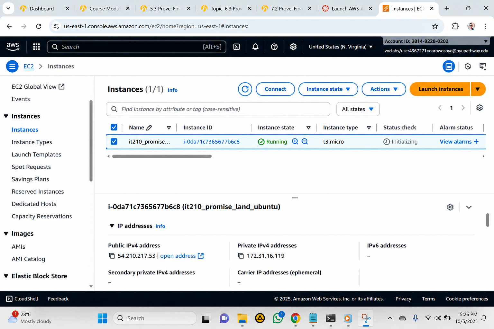
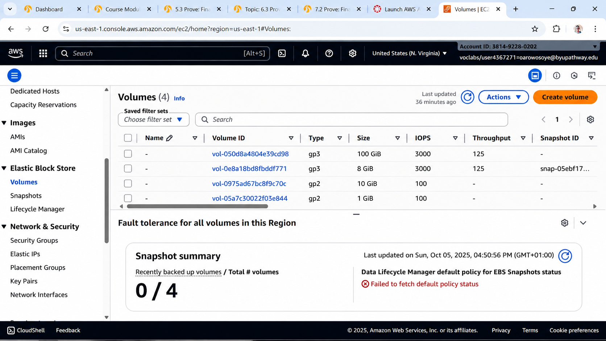
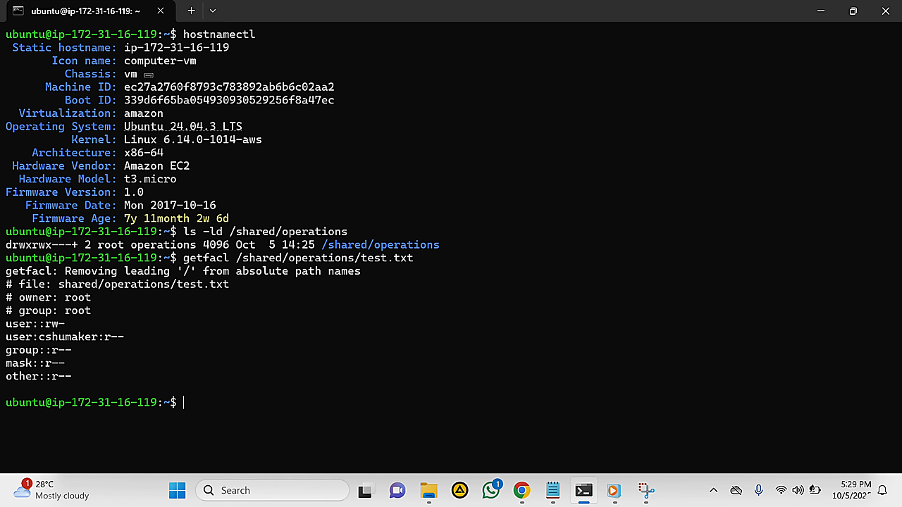
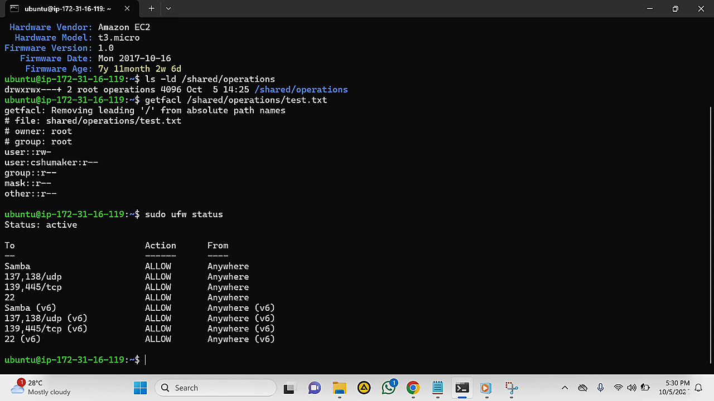
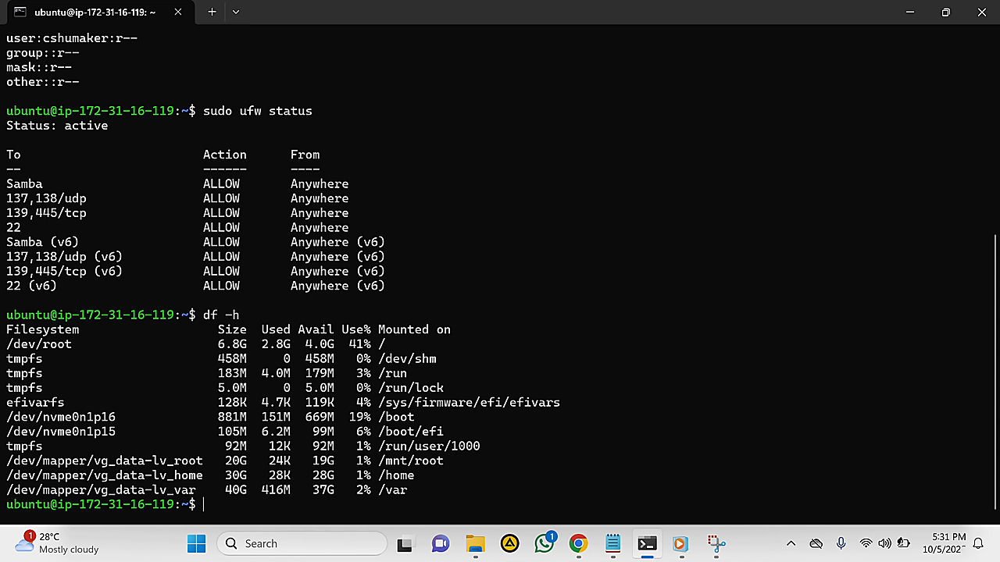
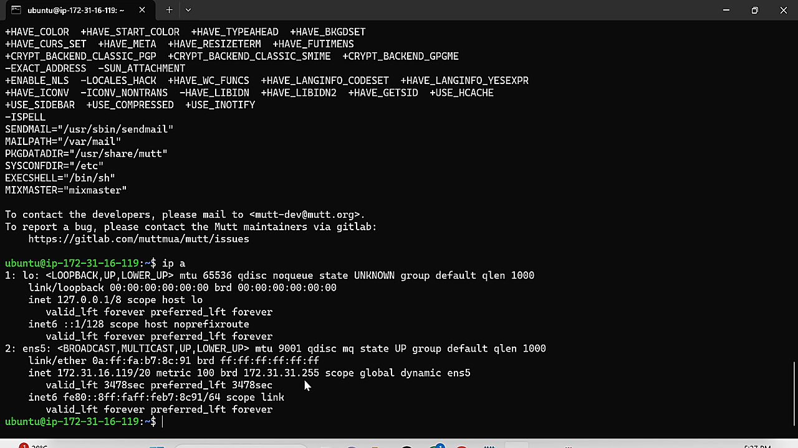

# 🖥️ Enterprise Linux Infrastructure Deployment for PromisedLand.com

> **Designing and deploying a secure, scalable Linux infrastructure on Amazon Web Services (AWS) to support enterprise web services, storage management, networking, and system security.**
---
---

## 📋 Project Information

| **Detail** | **Information** |
|---|---|
| **Project Type** | Enterprise Linux Infrastructure Deployment |
| **Role** | Linux Systems Administrator |
| **Environment** | Amazon Web Services (AWS) |
| **Operating System** | Ubuntu Server 24.04 LTS |
| **Cloud Platform** | Amazon EC2 |
| **Project Status** | Completed |
| **Focus Areas** | Linux Administration, Cloud Infrastructure, Security, Storage Management |
| **Skills Applied** | Linux, AWS EC2, Apache2, LVM, DNS, SSH, ACLs, UFW |

---

## 🚀 Executive Summary

This project demonstrates the deployment and administration of an enterprise Linux infrastructure hosted on Amazon Web Services (AWS).

The environment was built using **Ubuntu Server 24.04 LTS on Amazon EC2** and incorporated practical Linux administration, cloud infrastructure, storage management, web services, networking, access control, and security practices.

Key implementation areas included **Logical Volume Manager (LVM), Apache2, DNS, SSH, Linux users and groups, Access Control Lists (ACLs), UFW firewall configuration, and backup planning**.

The project provided hands-on experience combining Linux system administration with AWS cloud infrastructure and strengthened my understanding of how cloud-hosted Linux environments can be designed, secured, and maintained for enterprise workloads.

---

## 🎯 Business Challenge

PromisedLand.com required a reliable and secure server environment capable of supporting business web services while providing flexibility for future growth.

The project presented several infrastructure requirements, including effective storage management, controlled user access, secure remote administration, reliable web and DNS services, and protection against unauthorized network access.

To address these requirements, an **Ubuntu Server 24.04 LTS environment was deployed on Amazon EC2**, combining Linux system administration practices with AWS cloud infrastructure.

The solution was designed to provide a practical foundation for hosting enterprise services while maintaining security, manageability, and scalability.

---

## 🎯 Project Objectives

The primary objectives of this project were to:

- Deploy and configure **Ubuntu Server 24.04 LTS on Amazon EC2**.
- Implement flexible storage management using **Logical Volume Manager (LVM)**.
- Configure Linux users, groups, permissions, and **Access Control Lists (ACLs)**.
- Deploy and configure **Apache2** for web services.
- Configure **DNS services** for reliable name resolution.
- Secure remote administration using **SSH**.
- Configure the **UFW firewall** to control network access.
- Develop a backup and recovery strategy to support business continuity.
- Apply practical Linux and cloud administration best practices.

---

## 👨🏽‍💻 My Role

As the **Linux Systems Administrator**, I was responsible for deploying, configuring, securing, and documenting the infrastructure.

My responsibilities included:

- Provisioning and configuring the Ubuntu Server environment on **Amazon EC2**.
- Managing Linux storage using **LVM**.
- Creating and managing users, groups, permissions, and ACLs.
- Installing and configuring **Apache2** and DNS services.
- Configuring secure remote access through **SSH**.
- Implementing and managing **UFW firewall rules**.
- Testing system connectivity, services, storage, and security configurations.
- Documenting the completed infrastructure and administrative procedures.

This project was particularly valuable because it gave me practical experience combining **Linux system administration with AWS cloud infrastructure**.

---

## 🧰 Technologies Used

| **Technology** | **Purpose** |
|---|---|
|  **Ubuntu Server 24.04 LTS** | Enterprise Linux operating system used to host and manage server services. |
|  **Amazon EC2** | Cloud platform used to provision and host the Linux server. |
| **LVM** | Provides flexible storage allocation and management. |
|  **Apache2** | Web server used to host web services. |
| **Bind9 DNS** | Provides domain name resolution and DNS services. |
|  **SSH** | Provides secure remote administration of the Linux server. |
| **UFW Firewall** | Controls network traffic and restricts unauthorized access. |
| **Linux Users & Groups** | Manages authentication, authorization, and administrative access. |
| **ACLs** | Provides granular file and directory access permissions. |
|  **Amazon S3** | Supports the planned backup and disaster recovery strategy. |

---

---

## 🏗️ Solution Architecture

The infrastructure follows a layered architecture in which **Amazon EC2 provides the cloud computing foundation**, while Ubuntu Server hosts and manages the enterprise services.

The architecture combines web services, DNS, secure remote administration, storage management, access controls, and firewall protection into a single managed Linux environment.

### Architecture Flow

<pre>
                         ☁️ Amazon Web Services
                                  │
                                  ▼
                       ┌─────────────────────┐
                       │     Amazon EC2      │
                       │ Ubuntu Server 24.04 │
                       └──────────┬──────────┘
                                  │
             ┌────────────────────┼────────────────────┐
             │                    │                    │
             ▼                    ▼                    ▼
       🌐 Apache2             🌍 Bind9 DNS          🔐 SSH
       Web Services           Name Resolution      Remote Access
             │                    │                    │
             └────────────────────┼────────────────────┘
                                  ▼
                       ┌─────────────────────┐
                       │     LVM Storage     │
                       └──────────┬──────────┘
                                  │
                    ┌─────────────┼─────────────┐
                    ▼             ▼             ▼
                 👥 Users       🔑 ACLs       🛡️ UFW
                 & Groups      Permissions    Firewall
                                  │
                                  ▼
                       ☁️ Amazon S3 Backup
</pre>

#### Architecture Overview

The **Ubuntu Server** instance serves as the central platform for the infrastructure. **Apache2** provides web services, while **Bind9** handles DNS functionality and **SSH** enables secure remote administration.

Storage is managed using **LVM**, allowing disk resources to be organized and expanded efficiently. Linux users, groups, and **ACLs** provide controlled access to system resources, while **UFW** adds a network-level security layer.

A planned **Amazon S3 backup strategy** provides an additional layer of resilience for business continuity and disaster recovery.

---

## 🔐 Security Considerations

Security was a core consideration throughout the deployment. The infrastructure uses multiple layers of protection to reduce unauthorized access and improve system resilience.

#### 🔑 Secure Remote Access

**SSH** was configured to provide secure remote administration of the Ubuntu Server environment while reducing exposure to unauthorized access.

#### 🛡️ Network Protection

The **UFW firewall** was configured to control network traffic and restrict access to only the services required by the infrastructure.

#### 👥 Access Control

Linux **users, groups, file permissions, and ACLs** were used to control access to system resources and apply the principle of least privilege.

#### 📦 System Protection

The server environment was maintained using appropriate system administration and security practices, including system updates and controlled access to critical resources.

#### 💾 Backup & Recovery

A planned **Amazon S3 backup strategy** provides an additional layer of protection for critical data and supports business continuity and disaster recovery.

Together, these controls create a layered security approach that protects the server while maintaining the accessibility required for legitimate administration and enterprise services.

---

## ⚙️ Implementation Process

The infrastructure was deployed through a structured process covering cloud provisioning, Linux configuration, service deployment, security hardening, and backup planning.

#### Phase 1 — AWS & Server Deployment

- Provisioned an **Amazon EC2** instance.
- Installed and configured **Ubuntu Server 24.04 LTS**.
- Updated the operating system and installed required packages.
- Verified server connectivity and system resources.

#### Phase 2 — Storage Configuration

- Configured **Logical Volume Manager (LVM)**.
- Created and organized logical volumes.
- Mounted and verified the required file systems.
- Prepared the storage environment for future expansion.

#### Phase 3 — Enterprise Services

- Installed and configured **Apache2** for web services.
- Configured **Bind9 DNS** for name resolution.
- Configured **SSH** for secure remote administration.
- Verified service availability and network connectivity.

#### Phase 4 — Security & Access Control

- Created and configured Linux users and groups.
- Applied file ownership and permissions.
- Configured **Access Control Lists (ACLs)** for granular access.
- Enabled and configured the **UFW firewall**.
- Reviewed network access and security settings.

#### Phase 5 — Backup & Documentation

- Developed a backup strategy using **Amazon S3**.
- Verified system configuration and services.
- Documented the infrastructure and administrative procedures.
- Reviewed the completed environment for maintainability and future expansion.

---

## 📊 Results & Business Benefits

The completed infrastructure provides a secure and maintainable Linux environment hosted on AWS. The deployment demonstrates how cloud infrastructure and Linux administration can work together to support enterprise services.

#### ☁️ Cloud Infrastructure

The Linux environment was successfully deployed on **Amazon EC2**, providing a flexible cloud-based platform for hosting and managing server workloads.

#### 🔐 Improved Security

SSH, UFW, Linux permissions, users and groups, and ACLs provide multiple layers of protection for the server and its resources.

#### 💾 Flexible Storage

LVM provides a structured approach to storage management and allows storage resources to be expanded as future requirements change.

#### 🌐 Reliable Services

Apache2 and Bind9 provide essential web and DNS capabilities within the Linux environment.

#### 🛠️ Improved Administration

Structured user management, permissions, remote administration, and documented configurations make the environment easier to maintain.

#### ♻️ Business Continuity

The planned Amazon S3 backup strategy provides a foundation for protecting critical data and supporting future disaster recovery requirements.

Overall, the project demonstrates a practical combination of **AWS cloud infrastructure, Linux administration, security, and enterprise systems management**.

---

## 💡 Skills Demonstrated

This project strengthened my ability to combine cloud infrastructure with practical Linux system administration and security practices.

#### ☁️ Cloud & Infrastructure

- Amazon Web Services (AWS)
- Amazon EC2
- Cloud Infrastructure Deployment
- Infrastructure Planning
- Server Provisioning

#### 🐧 Linux Administration

- Ubuntu Server Administration
- Linux File System Management
- Logical Volume Manager (LVM)
- Linux Users & Groups
- File Permissions
- Access Control Lists (ACLs)
- Apache2
- Bind9 DNS
- SSH

#### 🔐 Security

- UFW Firewall Configuration
- Secure Remote Administration
- Access Control
- Least-Privilege Principles
- Security Hardening
- Backup & Recovery Planning

#### 🤝 Professional Skills

- Systems Analysis
- Problem Solving
- Technical Documentation
- Infrastructure Planning
- Critical Thinking
- Risk Assessment
- Troubleshooting

This project demonstrates my ability to deploy, configure, secure, and document a cloud-hosted Linux environment while considering both technical requirements and organizational needs.

---

## 📚 Lessons Learned

This project strengthened my understanding of how Linux administration and cloud infrastructure work together to support reliable enterprise systems.

One of the most important lessons I learned was the importance of **planning infrastructure before implementation**. Storage, networking, security, user access, and services must be considered together rather than configured independently.

The project also gave me my **first practical experience with AWS cloud services**, helping me understand how a Linux server can be provisioned and managed within a cloud environment.

I learned that security should be integrated throughout the deployment process. SSH security, firewall rules, user permissions, ACLs, and controlled access all contribute to a stronger overall infrastructure.

Working with LVM also improved my understanding of flexible storage management and how infrastructure can be designed to accommodate future growth.

Overall, this project gave me a strong foundation in **cloud-based Linux administration** and increased my confidence in working with AWS infrastructure.

---

## 🚀 Future Improvements

Although the current infrastructure meets the project's requirements, several improvements could further strengthen scalability, automation, monitoring, and security.

- ☁️ **Infrastructure as Code:** Use Terraform or AWS CloudFormation to automate infrastructure deployment and configuration.
- ⚙️ **Configuration Management:** Introduce Ansible to automate server configuration and maintain consistency.
- 📦 **Containerization:** Deploy Docker containers to improve application portability and simplify service management.
- 📊 **Monitoring:** Configure Amazon CloudWatch for system monitoring, performance metrics, and automated alerts.
- 🔎 **Centralized Logging:** Implement a centralized logging and security monitoring solution for improved visibility and incident investigation.
- 💾 **Automated Backups:** Implement scheduled automated backups and regularly test recovery procedures.
- 🔐 **Advanced Security:** Introduce additional AWS security services and automated security assessments as the infrastructure grows.

These improvements would help evolve the environment from a manually managed Linux deployment toward a more automated, observable, and resilient cloud infrastructure.

---

## 🏆 Key Achievements

- ☁️ Successfully deployed **Ubuntu Server 24.04 LTS on Amazon EC2**.
- 🐧 Applied practical **Linux system administration** principles.
- 💾 Implemented flexible storage management using **LVM**.
- 🌐 Configured **Apache2 web services and Bind9 DNS**.
- 🔐 Implemented **SSH, UFW, Linux permissions, users, groups, and ACLs**.
- 💡 Gained practical experience combining **AWS cloud infrastructure with Linux administration**.
- 📚 Documented the infrastructure and administrative procedures for future maintenance.
- 🛡️ Developed a backup and disaster recovery strategy using **Amazon S3**.

---

## 📸 Deployment Evidence

The following screenshots provide visual evidence of the AWS and Linux infrastructure deployed during the project.

#### ☁️ AWS EC2 Instance Deployment

*Screenshot showing the Ubuntu Server instance running on Amazon EC2, including the instance status and server configuration.*

  

#### 💾 Amazon EBS Storage Configuration

*Screenshot showing the Amazon EBS volumes provisioned for the Linux infrastructure.*

  

#### 🐧 Linux System Information

*Screenshot showing Ubuntu Server system information and the Amazon EC2 environment.*

  

#### 🔐 Linux File Permissions & ACLs

*Screenshot showing Linux file ownership, permissions, and Access Control List configuration.*

  

#### 🛡️ UFW Firewall Configuration

*Screenshot showing the active UFW firewall and configured network access rules.*

  

#### 💾 Linux Storage & Network Configuration

*Screenshot showing Linux storage utilization and network interface configuration.*

  

---

## 🧭 Portfolio Navigation

← [Back to Projects](../../README.md)

🏠 [Home](../../../README.md)

👤 [About Me](../../../about/README.md)
