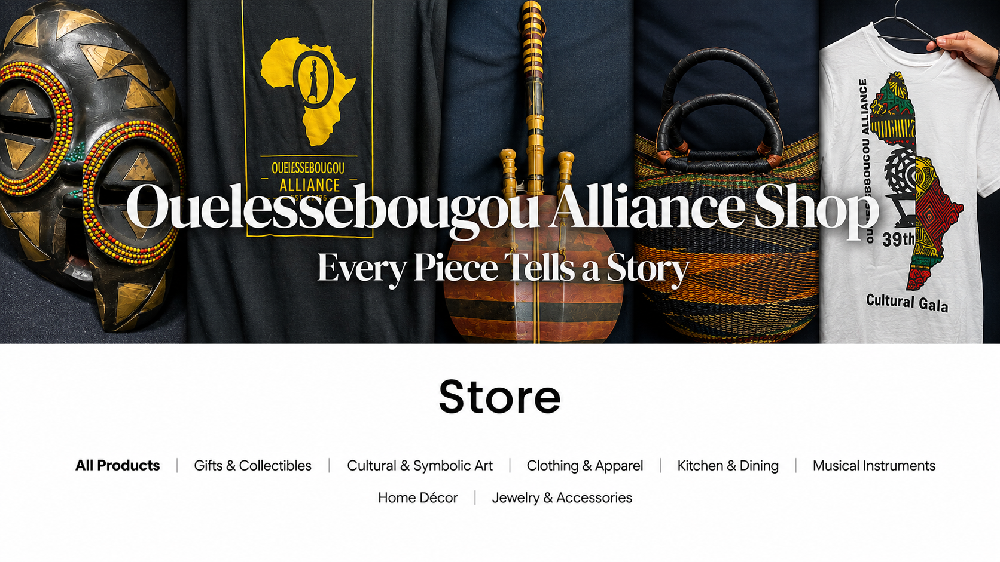
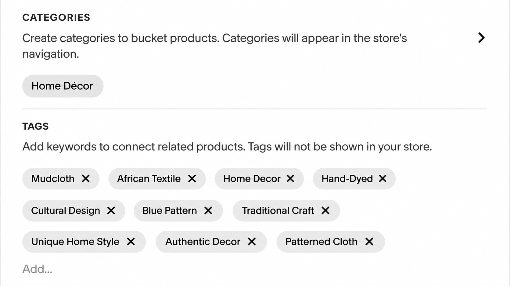
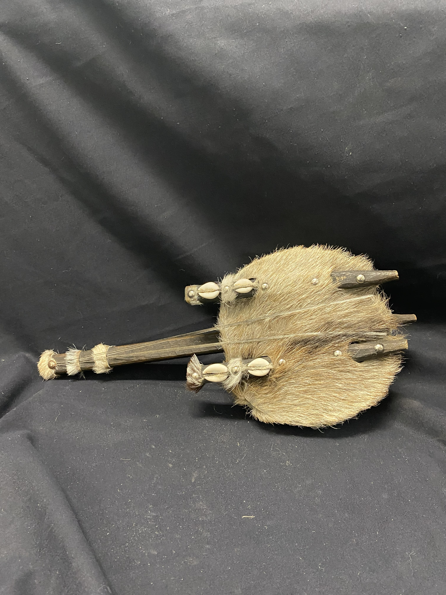
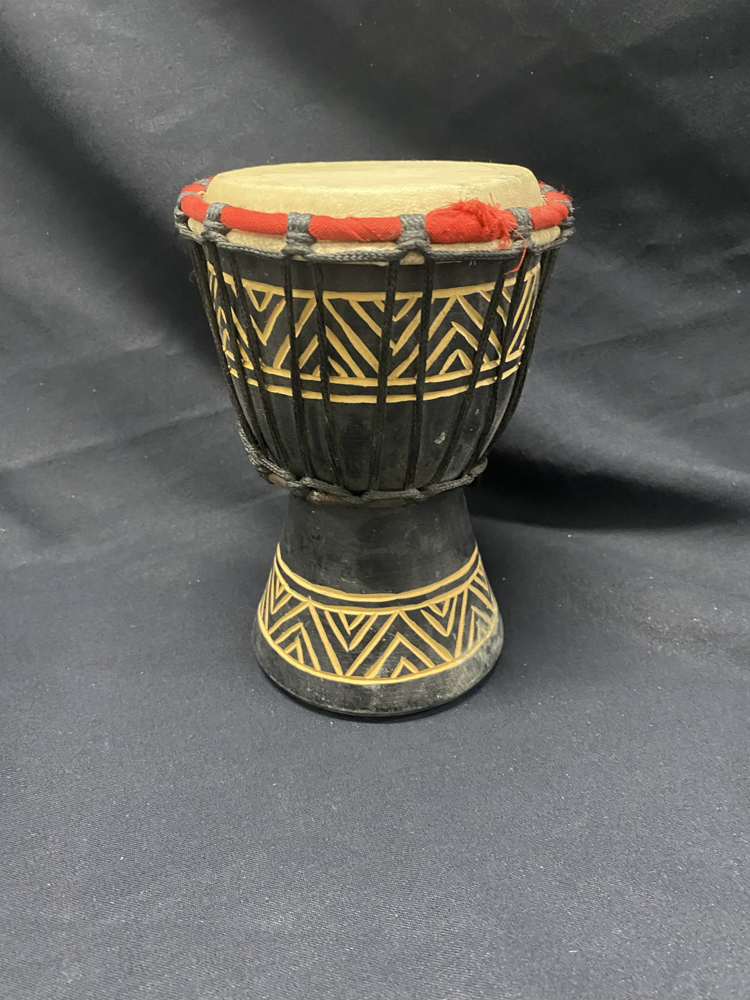
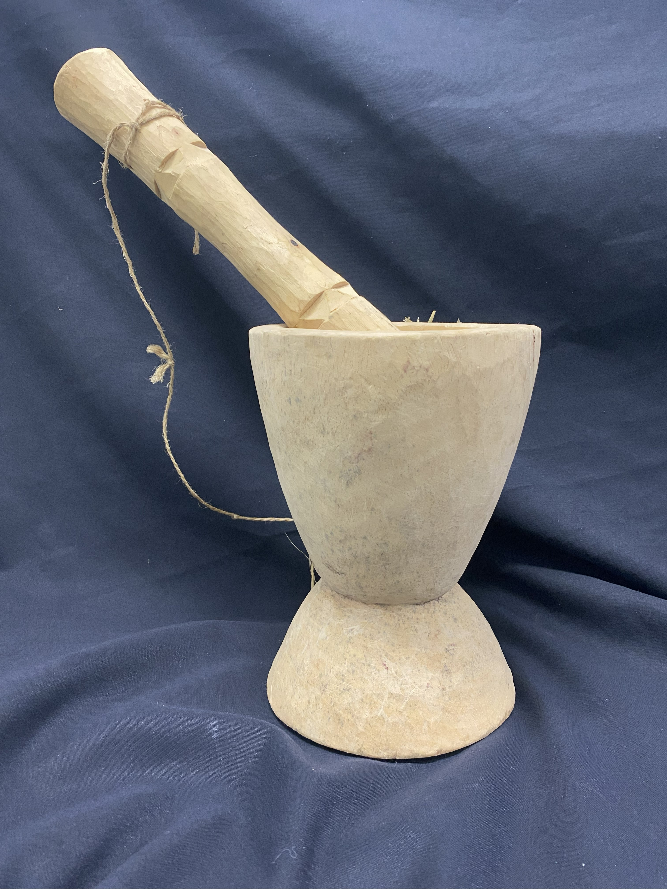
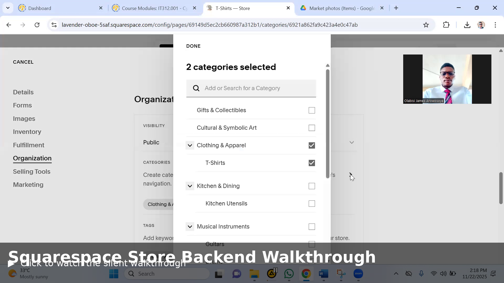

# 🛍️ African Market Online Store — Web Design & E-Commerce

**Designing and building an accessible online marketplace that connects African artisans and cultural products with a global audience through Squarespace.**

---

---

## 📋 Project Information

| **Details** | **Information** |
|---|---|
| **Project Type** | Web Design & E-Commerce |
| **Organization** | Ouelessebougou Alliance |
| **Platform** | Squarespace |
| **Role** | Co-Project Manager |
| **Project Duration** | September 2025 – December 2025 |
| **Industry** | Nonprofit / Cultural Marketplace |
| **Website** | [African Market Store](https://www.lifteachother.org/store) |
| **Products Added** | 90+ handcrafted products |
| **Primary Focus** | E-Commerce, Content Management, Product Catalog, User Experience |
| **Project Status** | Completed |

---

## 🎯 Executive Summary

The African Market Online Store project was a web design and e-commerce initiative developed for the **Ouelessebougou Alliance** to create a sustainable online marketplace for handcrafted products from Mali. The project transformed the organization's traditional, event-based product sales into a digital storefront capable of reaching supporters and customers beyond local communities.

As one of two Project Managers, I helped coordinate the project and contributed directly to the development and management of the store. My responsibilities included editing product content, uploading product images, creating product categories, adding tags, configuring shipping and payment settings, setting up sales tax and fees, and customizing product details within Squarespace.

The completed store contains **90+ handcrafted products**, organized into categories such as clothing, jewelry, art, and cultural artifacts. The project also incorporated visual storytelling, promotional content, social media connections, and email-capture features to support the Alliance's broader fundraising and community mission. :contentReference[oaicite:3]{index=3}

The project was designed not only as an online shop but also as a storytelling and fundraising platform that could be maintained by the organization after project completion. :contentReference[oaicite:4]{index=4}

---

## 🧩 Business Challenge

Before the project, the Ouelessebougou Alliance primarily relied on in-person events, local fundraising, and word-of-mouth to promote its products and support its mission. This approach created strong community connections but limited the organization's visibility to potential supporters and customers outside its immediate reach.

The organization also faced limited technical resources, including the absence of in-house web developers and a clear long-term plan for maintaining an online store. :contentReference[oaicite:0]{index=0}

The project therefore needed to create more than a traditional online shop. The solution needed to:

- Establish a professional online presence for the African Market.
- Make handcrafted products accessible to a wider audience.
- Organize products into clear and intuitive categories.
- Provide accurate product information, pricing, and images.
- Create a simple system that the organization could maintain independently.
- Support the Alliance's fundraising and community-development mission.

---

## 👨🏽‍💻 My Role

I served as one of the two **Project Managers** on the team, working alongside the project team and sponsor to coordinate the development of the African Market Online Store. :contentReference[oaicite:1]{index=1}

My responsibilities combined project coordination with hands-on website and e-commerce management.

#### Project Management

- Coordinated project activities and priorities with the team.
- Participated in weekly meetings with the sponsor and project team.
- Helped keep tasks aligned with project goals and deliverables.
- Collaborated with team members to improve the store's organization and user experience.

#### Website & E-Commerce Management

- Edited and organized product information.
- Uploaded product images and descriptions.
- Created and organized product categories.
- Added product tags for easier organization and discovery.
- Customized product details and presentation.
- Assisted with shipping configuration.
- Assisted with payment configuration.
- Configured sales tax and applicable fees.
- Reviewed product presentation and store usability.
- Supported the development of a mobile-friendly shopping experience.

#### Content Management

I also helped transform the product information and media provided by the sponsor into organized, customer-facing content within Squarespace. The project ultimately included more than 90 handcrafted products with photographs, descriptions, and prices. :contentReference[oaicite:2]{index=2}

---

## ⭐ Project Highlights

- 🛍️ **90+ Products Published** — Uploaded and organized handcrafted African products with images, descriptions, and pricing.
- 🗂️ **Product Organization** — Created categories and tags to improve product navigation and discovery.
- ⚙️ **E-Commerce Configuration** — Assisted with shipping, payment, sales tax, and fee configuration.
- 🎨 **Product Presentation** — Customized product details and visual presentation for a consistent storefront experience.
- 📱 **Responsive Experience** — Helped ensure the store provided a user-friendly experience across devices.
- 🌍 **Global Accessibility** — Helped transform locally promoted products into an online marketplace accessible to a broader audience.
- 📚 **Knowledge Transfer** — Supported documentation and walkthrough resources so the organization could independently manage products and update the store after project completion. :contentReference[oaicite:3]{index=3}

---

## ⚙️ Implementation Process

The project followed a collaborative, requirement-driven process that combined project management, content development, e-commerce configuration, and user-experience considerations.

#### Phase 1 — Requirements Gathering

- Met with the project sponsor to understand the organization's goals and expectations.
- Identified the purpose of the store as both an e-commerce platform and a fundraising and awareness tool.
- Defined product categories and considered the cultural context behind the products.
- Reviewed the information, images, and product materials provided by the organization.

The requirements-gathering process helped ensure that the store reflected both the technical needs of the project and the cultural identity of the products. :contentReference[oaicite:0]{index=0}

#### Phase 2 — Store & Product Development

- Built and organized the online store using Squarespace.
- Uploaded 90+ handcrafted products with photographs, descriptions, and prices.
- Created product categories and tags to improve organization and navigation.
- Edited product descriptions and customized product details.
- Added visual content and supporting information to product pages.
- Optimized the store for mobile users.

More than 90 products were ultimately added to the store, organized into broad collections including clothing, jewelry, art, and cultural artifacts. :contentReference[oaicite:1]{index=1}

#### Phase 3 — E-Commerce Configuration

- Configured product and inventory settings.
- Assisted with shipping and delivery setup.
- Reviewed payment configuration and transaction flow.
- Configured sales tax and applicable fees.
- Organized backend workflows for ongoing store management.

The project's backend tutorial specifically covered product creation, product-page customization, shipping, payments, sales tax, fees, and efficient product duplication. :contentReference[oaicite:2]{index=2}

#### Phase 4 — Testing, Documentation & Handover

- Reviewed product presentation and store navigation.
- Supported mobile-friendly optimization.
- Created backend instructions and a Squarespace walkthrough.
- Prepared resources to help the organization independently manage products and store content after project completion.

The project deliberately included documentation and a walkthrough so the Alliance could maintain inventory, update content, and manage the store without ongoing third-party technical support. :contentReference[oaicite:3]{index=3}

---

## 🛠️ Technologies & Tools

#### 🌐 Web & E-Commerce

#### 🛍️ Store Management

Key capabilities included:

- Product and inventory management
- Product categories and tags
- Product-page customization
- Shipping and delivery configuration
- Payment configuration
- Sales tax and fee management
- Content and image management
- Responsive design
- Social media integration
- Email capture

The project also incorporated banners, promotional video content, social media links, and email-capture tools to support engagement beyond the storefront itself. :contentReference[oaicite:4]{index=4}

---

## 📈 Business Impact

The completed store moved the African Market from primarily manual and event-based selling toward a more accessible and digitally scalable e-commerce model. The platform provides the organization with a durable way to showcase and sell handmade products while supporting its broader fundraising and community mission. :contentReference[oaicite:6]{index=6}

#### 🌍 Expanded Reach

The online storefront makes the organization's products accessible beyond local events and community-based sales, creating opportunities to reach new customers and supporters.

#### 🛍️ Improved Product Accessibility

More than 90 handcrafted products were organized into a searchable online catalog with photographs, descriptions, pricing, categories, and tags.

#### ⚙️ Improved Store Operations

Squarespace's inventory and product-management capabilities give the organization greater control over product listings, updates, and ongoing store administration. :contentReference[oaicite:7]{index=7}

#### 💰 Fundraising Support

The store provides a digital sales channel that supports the Alliance's fundraising objectives while connecting purchases with its broader community mission.

#### 📚 Sustainable Knowledge Transfer

The project did not end with the website. Backend instructions and a complete walkthrough were provided so the organization could continue updating products and managing store content independently. :contentReference[oaicite:8]{index=8}

#### 🌱 Foundation for Future Growth

The store was designed to evolve through new products, refreshed layouts, seasonal collections, social media engagement, email communication, reviews, and analytics. :contentReference[oaicite:9]{index=9}

---

## 💡 Skills Demonstrated

This project allowed me to combine project management, web design, e-commerce administration, content management, and stakeholder collaboration in a real-world environment.

#### 🌐 Technical Skills

- Squarespace Website Management
- E-Commerce Configuration
- Product & Inventory Management
- Content Management
- HTML & CSS
- Responsive Web Design
- Product Categorization & Tagging
- Shipping & Payment Configuration
- Sales Tax & Fee Configuration
- Image & Media Management

#### 🤝 Professional Skills

- Project Management
- Stakeholder Communication
- Team Collaboration
- Requirements Gathering
- Content Organization
- Problem Solving
- Technical Communication
- User Experience Thinking
- Documentation & Knowledge Transfer

---

## 📚 Lessons Learned

This project taught me that successful web development is not only about creating a visually appealing website. It requires understanding the organization's goals, its audience, and the people who will maintain the solution after delivery.

One of the most important lessons was the value of designing for sustainability. The project team created backend instructions and a walkthrough so that the Ouelessebougou Alliance could manage products, update content, and operate the store without depending on external technical support. :contentReference[oaicite:0]{index=0}

I also learned the importance of balancing technical possibilities with the organization's available resources. Some features, such as fulfillment and customer reviews, required additional sponsor decisions because of associated costs. The team therefore prioritized core functionality that directly supported the store's fundraising purpose. :contentReference[oaicite:1]{index=1}

Most importantly, the experience strengthened my confidence in coordinating a real-world project while communicating technical concepts with non-technical stakeholders. :contentReference[oaicite:2]{index=2}

---

## 🚀 Future Improvements

The completed store provides a strong foundation, but several improvements could further strengthen its reach, engagement, and long-term growth.

- 📊 **Analytics:** Implement and regularly review website and e-commerce analytics to understand visitor behavior and product performance.
- 🔎 **SEO:** Continue improving product titles, descriptions, and supporting content to increase search visibility.
- 📱 **Content Refresh:** Regularly introduce new products, layouts, and seasonal collections to encourage returning visitors.
- 📣 **Social Media Integration:** Continue connecting social media campaigns with products and the stories behind them.
- ⭐ **Customer Reviews:** Evaluate the addition of customer reviews when appropriate and financially practical.
- 📧 **Email Engagement:** Use email capture to maintain relationships with supporters and announce new products or collections.
- 🛍️ **E-Commerce Expansion:** Evaluate additional Squarespace commerce features as the organization's needs and budget evolve.

The project report specifically recommends ongoing content refreshes, seasonal collections, social media, email, reviews, and analytics as ways to grow the store and maintain engagement. :contentReference[oaicite:3]{index=3}

---

## 📸 Storefront & Project Media

#### 🛍️ African Market Store

The completed African Market Store provides an online storefront where visitors can explore handcrafted products from Mali, learn about their cultural significance, and support the Ouelessebougou Alliance through purchases.

  

*African Market Online Store — completed storefront.*

---

#### ⚙️ Squarespace Store Management

The project also involved hands-on management of the Squarespace backend, including product editing, categories, tags, shipping, payments, sales tax, fees, and product-page customization.

  

*Squarespace backend showing product organization and store management.*

---

#### 🏺 Original Product Photography

The store incorporated original product photographs supplied for the African Market collection. These images were used alongside product descriptions, categories, pricing, and tags to create consistent product listings.

  
  
  

*Selected original product photographs used in the African Market Online Store.*

---

### 🎥 Behind the Store

A visual walkthrough of the Squarespace backend demonstrates the hands-on e-commerce management performed during the project, including product editing, categories, tags, shipping, payments, sales tax, and store configuration.

  

*▶ Click the image to watch the silent Squarespace backend walkthrough.*

---

## 🧭 Portfolio Navigation

← [Back to Projects](../../README.md)

🏠 [Home](../../../README.md)

👤 [About Me](../../../about/README.md)

💼 [Professional Experience](../../../experience/README.md)

🛠️ [Technical Skills](../../../skills/README.md)

📜 [Certifications](../../../certifications/README.md)
